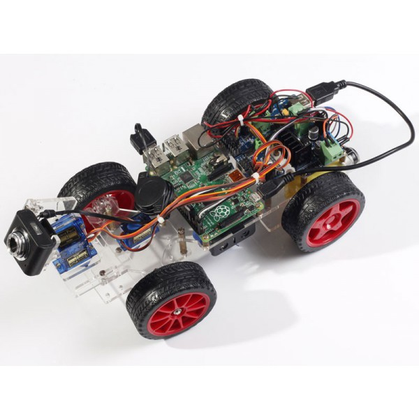

Our Mark I [scout car][] is a reconnaissance vehicle based on the
Raspberry Pi and the [[SunFounder Smart Video Car Kit|SunFounder Car
Kit]].

[scout car]: https://en.wikipedia.org/wiki/Scout_car

Components
----------

* [[Raspberry Pi 3]] (MSRP $35)
* [[SunFounder Smart Video Car Kit|SunFounder Car Kit]] (MSRP $94.99)
