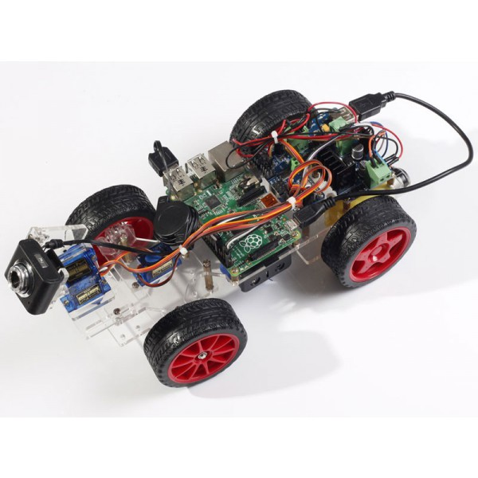

Our Mark I `scout car <https://en.wikipedia.org/wiki/Scout_car>`__ is a
robotic car based on the [[SunFounder Smart Video Car Kit|SunFounder Car
Kit]] for the [[Raspberry Pi]]. It can be used as a reconnaissance
vehicle in milsim scenarios or as an affordable development platform for
hacking on Conreality.

|Photo of Conreality Scout Car MkI|

Components
----------

Our recommended, known-good reference configuration is the following:

-  1× [[Vehicle Frame|Ground Vehicles]]: [[SunFounder Smart Video Car
   Kit|SunFounder Car Kit]] (MSRP $94.99)
-  1× [[Main Board|Main Boards]]: [[Raspberry Pi 3]] (MSRP $35)
-  1× [[Camera Module|Camera Modules]]: (included in vehicle frame kit)
-  2× Battery: Generic 3.7V 18650 rechargeable Li-ion battery (MSRP $6+)
-  1× Storage Card: Generic 4GB+ microSDHC or microSDXC card (MSRP $3+)

Note that you can fairly easily substitute [[another control
board|Supported Hardware]] than the Raspberry Pi 3. If you choose to do
so, adapt the firmware installation instructions that follow
accordingly.

Specifications
--------------

-  **Powertrain**: electric (7-12VDC)
-  **Drivetrain**: rear-wheel drive (2WD)
-  **Top speed**: TBD
-  **Radio range**: TBD

Assembly
--------

Expect assembly to take 3-4 hours. Download the `assembly
manual <https://www.sunfounder.com/learn/category/Smart-Video-Car-for-Raspberry-Pi.html>`__
and follow the video tutorials:

1. `Open Box & Basic
   Assembly <https://www.youtube.com/watch?v=dHjg_BDYvmA>`__
2. `Assembly Completed <https://www.youtube.com/watch?v=XV22rK1mw5g>`__
3. `Circuits <https://www.youtube.com/watch?v=Tg_g4YoAZdc>`__
4. `Software <https://www.youtube.com/watch?v=ZCYaufyU3XA>`__ (optional,
   for validation)

Installation
------------

To install Conreality on the vehicle, follow the [[Installation Guide]],
making sure to pay particular attention to any Raspberry Pi-specific
instructions.

Configuration
-------------

TODO

